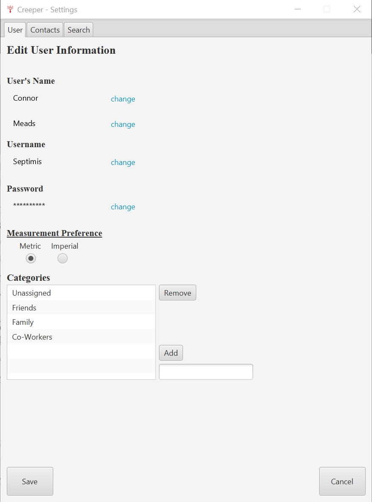

# Creeper
*This Program is **Legacy Code** and no further development will be done on it* 
This Program will not run on Linux or MacOS.  (See Q&A for details)
## Description
Creeper was intended to be used as a light background check that employers could use to check public records on a person.  A user begins by creating an account and is then greeted by the main screen which displays relevant information about a selected Person.

    
Take a tour

### Logging In
If you'll notice in the image below, the helper text reads 'Welcome Back!  Log in above or create a new account below!'.  This is because I already had an account set up prior to taking this screenshot.  If there were no accounts to be found, it would instead read, 'It seems like this is your first time here.  Click the link below to get started!'.

### Account Creation
Creating an account was two parts.  One screen to get your name, email, and measurement preference, and the next was to set a username and password.  This is actually one pane, however, the nodes within it are toggled to hidden and then visible.  I wasn't sure how to add and remove panes when I made this.

### Main Screen
This is where the user was supposed to review all of thier information.  Once a user has selected a Person object, they can then view all the information on this screen.  I remember being particularily proud of the list that showed the most recently viewed people.

### Adding a Person
Some of my first regexes were learned through this screen.  This screen took at least a month to make, and hosts one of my favorite programming memories.  A user can enter in all the known information about the person on this screen and hit submit.  After submit was pressed, Creeper was meant to crawl the web and search for any other information known about this person and fill it in.  Of course I never got to the web scraping part, but that was the idea.  I ended up writing my own phone number and email regex to validate information.  The biggest problem I had with this screen that I would love to highlight is the dynamic generation of nodes on the screen.  You will notice a '+' button located to the right of some fields.  The user could add as many of these fields as they wished.  Creating and removing a node became an incredibly difficult feat for me as I had to be able to reference the specific node if I wanted to delete it.  I struggled for weeks trying to solve this problem, then one day it hit me!  I could reference those nodes based on the X-axis they were on.  It seems simple and easy, but it was so satisfying to see my problem have a solution.

### Errors
Any program that accepts user input needs to be able to check for and correct potential user mistakes.  I accomplished this by using a pop up screen that placed passed in Error Text and displayed it to the user.

### Searching for a person
Once a user saved their contact, they were taken back to the blank main screen.  From here they could search the person they just made.

### Populating the Main Screen
After the user selects the desired contact, they are taken back to the main screen where they are initially given a condensed view of the contact.  They have the option to click the 'More Details' hypertext which will pull their information down to give all the found and entered information about the contact.  Just as with the account creation, this is simply nodes toggling visibility, not actually moving around.  This is obvious if you notice the scroll bar indicates that there is more content in the body than before.

### Settings
The tab panes was extremely helpful with my understanding of how panes and views work within JavaFX.  I really learned a lot from programming this portion of the project.  Despite the learning, this ended up killing my project strangely enough.  I got pretty far in the code and functionality, I just burnt out on this project and realized the scope of what I was trying to do and how unrealistic it was.  Regardless, this probably took the most time out of anything thus far.  The user settings was first, and very quick to program.  A user could simply alter the name, email, date of birth, and password they had entered.

The contact settings page was a huge undertaking and I did finish it, however, it took all of the challenges from adding a user and made it more difficult by altering it.  I found it much easier to completely read the contacts file, save it in memory, delete it, then re-write it with the updated information rather than just update it.  
  
The collapsing carrot buttons were a challenge to program as well as their height was difficult for me to measure.

  

## History
Creeper began just as I was learning about the concept of classes in my Computer Science classes.  The idea got me thinking about relationships between things in a whole new way.  I always thought it would be fun to be a Private Investigator in another life, so this program is really my attempt to automate it.  I remember falling asleep one night when the idea struck me that with how much information people leave out on the internet through social media, I could learn a terrifying amount about them.  The next day at work I started constructing all the relationships into classes on paper so I could program it later.  I spent time programming and drawing out sketches of what I wanted it to look like in my spare time and eventually I ended up with what we have today.  The majority of the work that went into creeper was done while I was taking a break from school and doing my Military Training courses.

## Build Instructions
Note:  Creeper will only build on Windows Operating System.  
[This instructional video](https://www.youtube.com/watch?v=H67COH9F718) is very helpful in building Creeper in VS Code.  Concepts are easily transferred to other IDE's. 
Dependencies:
 - [Java JDK 11.0](https://www.oracle.com/java/technologies/javase/javase-jdk8-downloads.html)
 - [JavaFX open SDK](https://gluonhq.com/products/javafx/)

## Learning
My time spent developing Creeper certainly did not go without a huge learning curve.  I can attribute some of the initial magic I felt programming to this project and I would spend long uninteruptted periods just programming this.  Here are some of the highlights I learned while programming Creeper.
### **Stages, Scenes, Panes, Groups, etc.**
I learned so much about how a pane works within a scene, and a scene works within a stage.  You can see the progression of my understanding throughout the project if you look at my main screen opposed to my settings page which uses a different pane for each tab.
### **Password Encryption**
Starting this project, I knew nothing about password encryption.  I wrote my own password encryption method within my program that I have used in other programs as well.  It is a simple [Caesar Cipher](https://en.wikipedia.org/wiki/Caesar_cipher), but it was a riot to write and have my friends attempt to crack.
### **Dynamic Creation & Removal of Nodes**
Within the Add Person screen, a user can add as many addresses, phone numbers, or emails as they need.  This meant I need to be able to create new text boxes and buttons in order to gather that information.  I also needed to be able to remove specific nodes.  This proved very challenging and stumped me for a week, but I was able to delete these nodes based on their current x-axis instead of accessing them in a list.  With a little more knowledge this wouldn't have proved very challenging, but at the time this was a massive breakthrough for me.
### **Reading and Writing from Files**
Prior to Creeper, I hadn't really read or wrote to files.  It's not very difficult, but it gave me lots of practice with how to do this in Java.  You will see lots of examples of how **not** to do it within my code.

## Q & A
### **Why won't Creeper run on anything but Windows OS?**
It will compile and run, however, the manner in which I wrote to files means that it will not save any data entered into it.  I don't believe you will be able to make an account since Linux and MacOS do not have a C: drive.
### **Does Creeper use a database?**
No.  I had no idea how to work with databases, so instead, I wrote everything I would need in text files within the C: drive.  This is why Creeper will not work on MacOS or Linux as I had no idea the differences between the file systems.  It was a really fun exercise to try and figure out how to read and write data to a file.  Once a user creates an account, Creeper makes a 'Creeper' file on the C: drive, and then a folder within that labled with the username of the User.  Any additional users will create an account within 'C:/Creeper/[username]'.  Within that folder is two .txt files.  One is named 'accountInfo.txt' and the other 'contacts.txt'.  Each line of the accountInfo.txt has a different peice of the user Info. It goes as follows:  
[0] : FirstName >\~> LastName  
[1] : Username  
[2] : Password (Encrypted)  
[3] : Categories (separated by >\~>)  
[4] : T / F (depending on if they wanted metric or not)

And the contacts.txt used one line per contact, and the contacts information is separated by >\~>.  I chose '>\~>' because I thought that would be the least likely combination of characters to be accidentally entered by a user.
### **Isn't saving my username and password on local .txt files a security risk?**
Yes it is.  I didn't know anything about SHA-256 or any other password hashing I might of used, so I determined to create my own.  My encryption algorithm turned out to just be a slightly complicated [Caesar Cipher](https://en.wikipedia.org/wiki/Caesar_cipher), but it was very satisfying to create. If you decide to build Creeper, I would suggest **not** saving your real password into it as it will be saved on your C: drive "encrypted".

### **Why did you stop developing Creeper?**
What I was trying to do was simply so far out of my reach that once I realized what this would take, I decided to retire the project.  I also did end up hitting a level of burn out with this project due to the first reason and the increasing size of Creeper was beginning to be confusing.  I grew during my time developing Creeper and as such, started noticing horrible programming practices.  If you open Main.java and start looking through my code, you'll notice the total mess that my code was.  It became so confusing to navigate that I would have to reacclimate myself to the code if I took a week off from developing it.